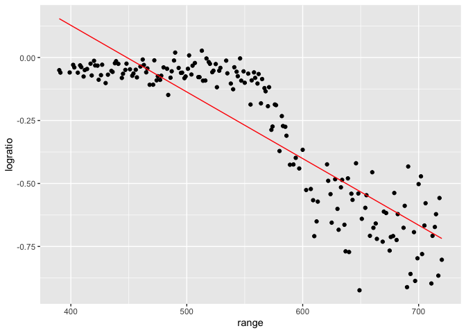
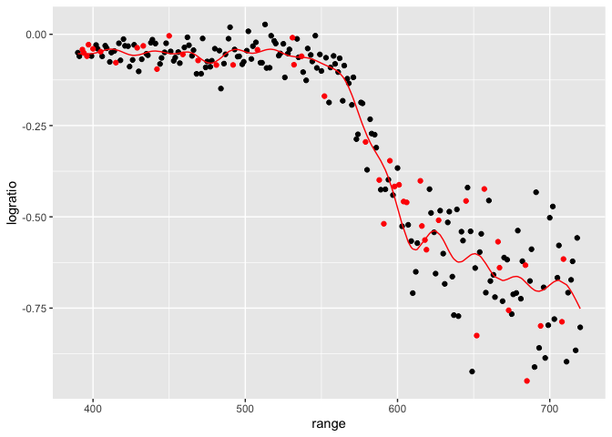
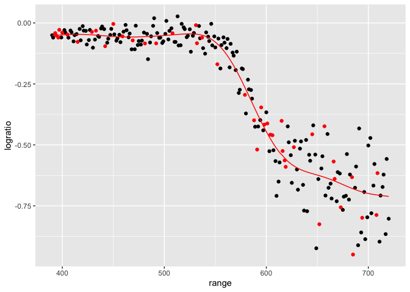
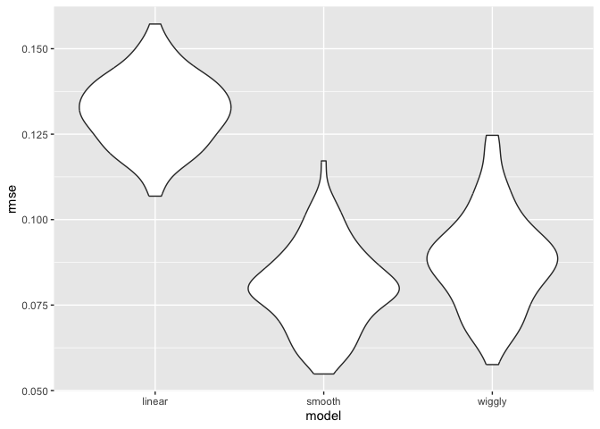
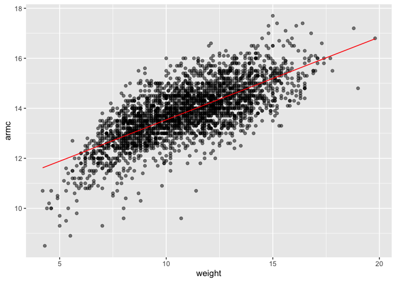
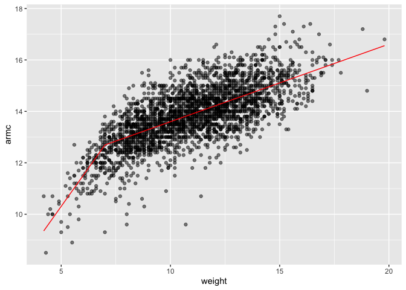

Cross Validation
================
Mahdi Maktabi
Nov 12, 2024

Load key packages.

Look at LIDAR data

``` r
data("lidar")

lidar_df = 
  lidar |> 
  as_tibble() |> 
  mutate(id = row_number())
```

``` r
lidar_df |> 
  ggplot(aes(x = range, y = logratio)) +
  geom_point()
```

<!-- -->

## Try to do CV

We will compare 3 model – one linear, one smooth, one wiggly.

Construct training and testing df.

``` r
train_df = sample_frac(lidar_df, size = .8)
test_df = anti_join(lidar_df, train_df, by = "id")
```

Look at these - this will overlay the one with the missing points and
then overlay the points in red.

``` r
ggplot(train_df, aes(x = range, y = logratio)) +
  geom_point() +
  geom_point(data = test_df, color = "red")
```

<!-- -->

Fit three models.

``` r
linear_mod = lm(logratio ~ range, data = train_df)
smooth_mod = gam(logratio ~ s(range), data = train_df)
wiggly_mod = gam(logratio ~ s(range, k = 30), sp = 10e-6, data = train_df)
```

Look at these fits.

``` r
train_df |> 
  add_predictions(linear_mod) |> 
  ggplot(aes(x = range, y = logratio)) +
  geom_point() +
  # geom_point(data = test_df, color = "red") +
  geom_line(aes(y = pred), color = "red")
```

<!-- -->

``` r
train_df |> 
  add_predictions(wiggly_mod) |> 
  ggplot(aes(x = range, y = logratio)) +
  geom_point() +
  geom_point(data = test_df, color = "red") +
  geom_line(aes(y = pred), color = "red")
```

<!-- -->

``` r
train_df |> 
  add_predictions(smooth_mod) |> 
  ggplot(aes(x = range, y = logratio)) +
  geom_point() +
  geom_point(data = test_df, color = "red") +
  geom_line(aes(y = pred), color = "red")
```

<!-- -->

Smooth model doesn’t do too much - captures the trends we are looking
for (“just right”).

Now compare these numerically using RMSE.

``` r
rmse(linear_mod, test_df)
```

    ## [1] 0.127317

``` r
rmse(smooth_mod, test_df)
```

    ## [1] 0.08302008

``` r
rmse(wiggly_mod, test_df)
```

    ## [1] 0.08848557

## Repeat the train / test split

``` r
cv_df = 
  crossv_mc(lidar_df, 100) |> 
  mutate(
    train = map(train, as_tibble),
    test = map(test, as_tibble)
  )
```

``` r
cv_df |> 
  pull(train) |> 
  nth(2) |> 
  as_tibble()
```

Fit models, extract RMSEs

``` r
cv_results_df = 
  cv_df |> 
  mutate(
    linear_mod = map(train, \(x) lm(logratio ~ range, data = x)),
    smooth_mod = map(train, \(x) gam(logratio ~ s(range), data = x)),
    wiggly_mod = map(train, \(x) gam(logratio ~ s(range, k = 30), sp = 10e-6, data = x))
  ) |> 
  mutate(
    rmse_linear = map2_dbl(linear_mod, test, rmse),
    rmse_smooth = map2_dbl(smooth_mod, test, rmse),
    rmse_wiggly = map2_dbl(wiggly_mod, test, rmse)
    )
```

Look at RMSE distribution

``` r
cv_results_df |> 
  select(starts_with("rmse")) |> 
  pivot_longer(
    everything(),
    names_to = "model",
    values_to = "rmse",
    names_prefix = "rmse_"
  ) |> 
  ggplot(aes(x = model, y = rmse)) +
  geom_violin()
```

<!-- -->

## Nepalese children DF

``` r
child_df = 
  read_csv("data/nepalese_children.csv") |> 
  mutate(
    weight_ch7 = (weight > 7) * (weight - 7)
  )
```

    ## Rows: 2705 Columns: 5
    ## ── Column specification ────────────────────────────────────────────────────────
    ## Delimiter: ","
    ## dbl (5): age, sex, weight, height, armc
    ## 
    ## ℹ Use `spec()` to retrieve the full column specification for this data.
    ## ℹ Specify the column types or set `show_col_types = FALSE` to quiet this message.

Look at the data.

``` r
child_df |> 
  ggplot(aes(x = weight, y = armc)) +
  geom_point(alpha = .5)
```

<!-- -->

Fit some models.

``` r
linear_mod = lm(armc ~ weight, data = child_df)
pwl_mod = lm(armc ~ weight + weight_ch7, data = child_df)
smooth_mod = gam(armc ~ s(weight), data = child_df)
```

``` r
child_df |> 
  add_predictions(linear_mod) |> 
  ggplot(aes(x = weight, y = armc)) +
  geom_point(alpha = .5) +
  geom_line(aes(y = pred), color = "red")
```

<!-- -->

``` r
child_df |> 
  add_predictions(pwl_mod) |> 
  ggplot(aes(x = weight, y = armc)) +
  geom_point(alpha = .5) +
  geom_line(aes(y = pred), color = "red")
```

<!-- -->

``` r
child_df |> 
  add_predictions(smooth_mod) |> 
  ggplot(aes(x = weight, y = armc)) +
  geom_point(alpha = .5) +
  geom_line(aes(y = pred), color = "red")
```

<!-- -->

CV to select models.

``` r
cv_df =
  crossv_mc(child_df, 100) |> 
  mutate(
    train = map(train, as_tibble),
    test = map(test, as_tibble)
  )
```

Apply models and extract RMSE

``` r
cv_results_df = 
  cv_df |> 
  mutate(
    linear_mod = map(train, \(x) lm(armc ~ weight, data = x)),
    pwl_mod    = map(train, \(x) lm(armc ~ weight + weight_ch7, data = x)),
    smooth_mod = map(train, \(x) gam(armc ~ s(weight), data = x)),
  ) |> 
  mutate(
    rmse_linear = map2_dbl(linear_mod, test, rmse),
    rmse_pwl = map2_dbl(pwl_mod, test, rmse),
    rmse_smooth = map2_dbl(smooth_mod, test, rmse)
  ) |> 
  select(starts_with("rmse")) |> 
  pivot_longer(
    everything(),
    names_to = "model",
    values_to = "rmse",
    names_prefix = "rmse_"
  ) |> 
  ggplot(aes(x = model, y = rmse)) +
  geom_violin()
```
